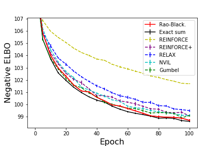
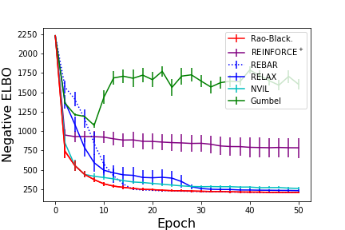

# Rao-Blackwellized Stochastic Gradients for Discrete Distributions

This repository contains an implementation of the method and reproduces the experiments described in 

https://arxiv.org/abs/1810.04777 

We wish to compute the gradient of an expectation
over a discrete random variable that takes a finite or countably infinite sample space. Since the random variable is discrete, the usual reparameterization trick does not apply. 

Many alternative stochastic gradient estimators have been proposed for scenarios when the 
reparameterization trick does not apply, such as RELAX [(Grathwohl et al., 2018)](https://arxiv.org/pdf/1711.00123.pdf), 
REBAR [(Tucker et al., 2017)](https://arxiv.org/abs/1703.07370),
NVIL [(Mnih & Gregor, 2014)](https://arxiv.org/abs/1402.0030), and Gumbel-softmax [(Jang et al., 2017)](https://arxiv.org/abs/1611.01144). 

In our paper, we describe a technique that can
be applied to reduce the variance of any such
estimator, without changing its bias. 

In brief, idea is to analytically sum categories where the random variable has high probability and sample the remaining terms.

If the random variable is concentrated around a few categories, then analytically summing the high probability categories nearly recovers the true gradient. This intuition is made precise using a **Rao-Blackwellization** argument. See our paper for more details. 

## Some results
This repository reproduces the results shown in the paper. Our implementation of this method can be found in `./rb_utils/`. We also implemented REBAR/RELAX, Gumbel-softmax, and NVIL for comparison. Our experiments can be found in the `./experiments/` folder. Two are highlighted here. 

One experiment examined our performance on a semi-supervised MNIST task [(Kingma et al., 2014)](https://arxiv.org/abs/1406.5298). Here, the discrete random variable is the digit label. We compare Rao-Blackwellizing the simple REINFORCE estimator against other SOTA methods. See our paper for more details. 

We also trained on a pixel attention task, where we had to locate an MNIST digit randomly placed on a 68 x 68 pixel background. The discrete random variable hence takes on $68^2$ categories. 

